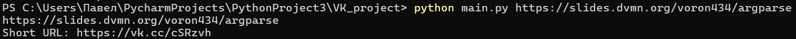
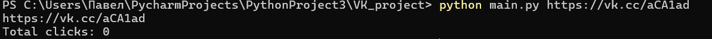

#  Обрезка ссылок с помощью Bitly

Проект для сокращения ссылок и получения статистики переходов через VK API. Django.

## Возможности

- Преобразует длинные URL в короткие с помощью VK API
- Получает статистику переходов по сокращенным ссылкам
- Скрипт сам определяет, является ли ссылка уже сокращенной через VK

## Запуск

- Скачайте код
- Установите зависимости командой `pip install -r requirements.txt`
- Перейдите на сайт VK для разработчиков
- Создайте новое приложение
- Получите токен доступа с разрешением utils
- Добавьте токен в файл .env
- Запустите программу командой ` python main.py ваша_ссылка`

## Функции скрипта

- `is_shorten_link(token, url)` - проверяет, является ли ссылка уже сокращенной через VK
- `count_clicks(token, short_url)` - подсчитывает общее количество переходов по сокращенной ссылке
- `count_clicks(token, short_url)` - Подсчитывает общее количество переходов по сокращенной ссылке
- `main()` - основная функция, обрабатывающая аргументы командной строки и координирующая работу остальных функций

## Примеры использования

Для обычной ссылки:

Для сокращённой VK ссылки:

Код написан в учебных целях — это урок в курсе по Python и веб-разработке на сайте [Devman](https://dvmn.org).
